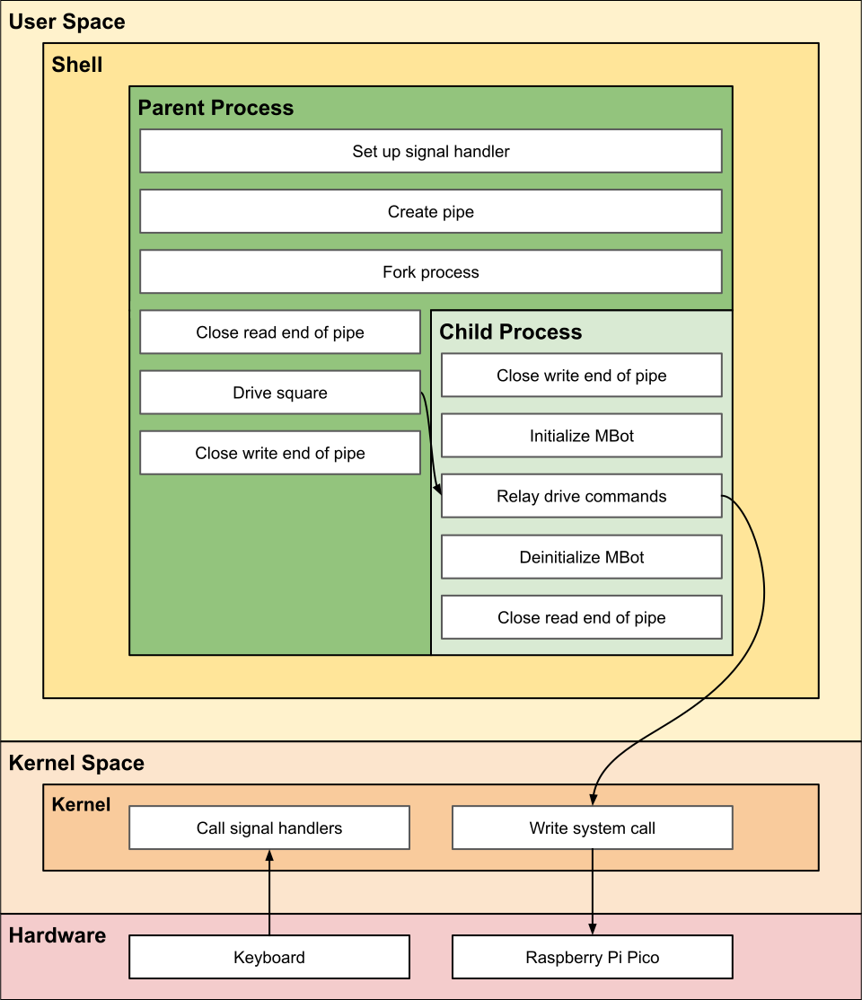
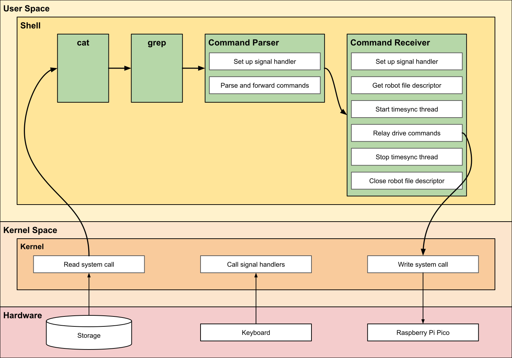
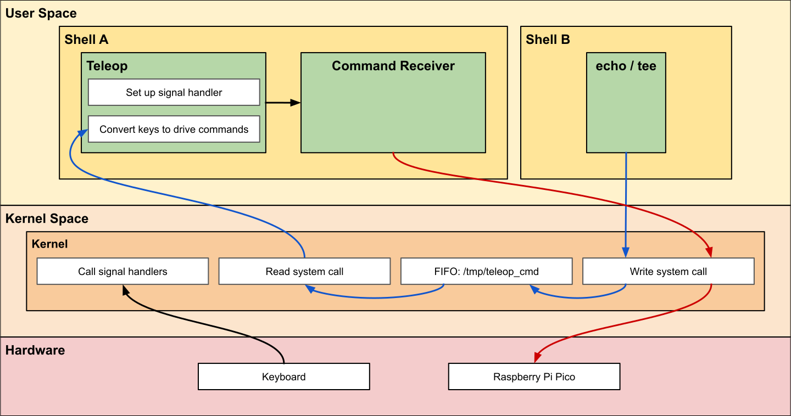

# Project 1: The Basix
{: .no_toc }
Due at 10:29 AM on January 22
{: .fs-6 .fw-300 }

## Getting the Starter Code
Navigate to the directory where you would like to store the code for this project. Run the following commands to install the project starter code or download it manually [here](https://www.dropbox.com/scl/fi/zxgaikunzs1aeemmgkrdh/Project1.tar.gz?rlkey=042mj9f2iqtk3b9hy8y83bz9w&st=t4pr174i&dl=0).
```bash
wget "https://www.dropbox.com/scl/fi/zxgaikunzs1aeemmgkrdh/Project1.tar.gz?rlkey=042mj9f2iqtk3b9hy8y83bz9w&st=t4pr174i&dl=0" -O p1.tar.gz
tar -xf p1.tar.gz
rm p1.tar.gz
```

It is *strongly* recommended to use GitHub to track the changes made to your project. First, create a new **private** repository in GitHub. Then, navigate to the project directory and run the following commands.
```bash
git init
git commit -m "first commit"
git branch -M main
git remote add origin [LINK TO REPO]
git push -u origin main
```
This will establish a main branch on the remote repository and add the starter code as the first commit.

## Learning Objectives
1. Implement and execute programs in a Unix-like operating system
2. Understand multiprocessing and process address spaces
3. Use anonymous pipes and FIFOs to marshal data across processes

## Overview
This project is an introduction to interprocess communication (IPC). It will cover the Unix command line, processes, anonymous pipes, and named pipes (FIFOs). There are 3 components to Project 1: **Drive Square**, **Command Parser & Receiver**, and **Keyboard Teleoperation**. This project is written entirely in C, *not C++*! They are very similar but have some distinct differences. If you have not programmed in C before, we recommend that you read [this guide](https://uva-cs.github.io/pdr/tutorials/09-c/index.html). The following instructions provide a high-level overview of the project. More detailed instructions are in the TODOs in the starter code.

## 1.1: Drive Square (1 point)
### TODO
- **`src/robot/util.c`**
  - Implement `signal_handler` function.
  - Implement `relay_drive_commands` function.
  
- **`src/drive_square.c`**
  - Implement `drive_square` and `main` functions.

Write a program that uses an anonymous pipe to drive the robot in a square pattern until ctrl-c is pressed. This program has command line arguments in the following format:
```plaintext
./drive_square <use_serial> <start_dir> <speed> <delay_ms>
```
1. `use_serial`: Used to initialize the MBot. If this flag is 0, the program will output commands to `stdout`. If it is nonzero, the program will send the commands to the MBot at `/dev/mbot_lcm`.
2. `start_dir`: This is a character that will determine the starting direction of program. It should be `N`, `S`, `E`, or `W`. If it is not one of these characters, the program should exit with code 1.
3. `speed`: This is a floating point value that will determine the speed for the robot in m/s. If the value is negative, the program should exit with code 1.
4. `delay_ms`: This is the delay in milliseconds that should occur between sending drive commands (`N`, sleep, `E`, sleep, etc.).

The process flow of drive square is pictured in the figure below.



## 1.2.1: Command Parser (3 points)
### TODO
- **`src/robot/util.c`**
  - Implement `read_line` function.
  - Implement `parse_and_forward_commands` function.
- **`src/cmd_parser.c`**
  - Implement `main` function.

Write a program that reads drive commands in text format from STDIN and writes encoded drive commands to STDOUT.

The text format for the drive commands is below.
```plaintext
string    float    float    float    int
id        vx       vy       wz       delay
```

Example commands are located in `command.txt`, shown below.
```plaintext
drive_square  0.5     0.0    0.0 1000
drive_square  0.0     0.5    0.0 1000
drive_square -0.5     0.0    0.0 1000
drive_square  0.0    -0.5    0.0 1000
drive_square  0.0     0.0    0.0 1000
drive_star    0.5000  0.0000 0.0 1000
drive_star   -0.4045 -0.2939 0.0 1000
drive_star    0.1545  0.4755 0.0 1000
drive_star    0.1545 -0.4755 0.0 1000
drive_star   -0.4045  0.2939 0.0 1000
drive_star    0.0000  0.0000 0.0 1000
drive_hex     0.0000  0.5000 0.0 1000
drive_hex     0.2500  0.4330 0.0 1000
drive_hex     0.5000  0.0000 0.0 1000
drive_hex    -0.2500  0.4330 0.0 1000
drive_hex     0.0000 -0.5000 0.0 1000
drive_hex    -0.2500 -0.4330 0.0 1000
drive_hex    -0.5000  0.0000 0.0 1000
drive_hex    -0.2500  0.4330 0.0 1000
drive_hex     0.0000  0.0000 0.0 1000
forward       0.5     0.0    0.0 1000
forward       0.0     0.0    0.0 1000
backward     -0.5     0.0    0.0 1000
backward      0.0     0.0    0.0 1000
left          0.0    -0.5    0.0 1000
left          0.0     0.0    0.0 1000
right         0.0     0.5    0.0 1000
right         0.0     0.0    0.0 1000
```

The drive commands should be serialized from text format to byte format, which is specified by the `drive_cmd_t` struct in `include/robot/robot.h`, shown below.
```c
#pragma pack(push, 1)
typedef struct drive_cmd_t {
    int64_t utime;
    float vx;
    float vy;
    float wz;
} drive_cmd_t;
#pragma pack(pop)
```

## 1.2.1: Command Receiver (3 points)
### TODO
- **`src/robot/util.c`**
  - Implement `relay_drive_commands` function.
- **`src/cmd_receiver.c`**
  - Implement `main` function.

Write a program that reads encoded drive commands from STDIN and forwards them to the mbot. This program has a command line argument in the following format:
```plaintext
./cmd_receiver <use_serial>
```
1. `use_serial`: Used to initialize the MBot. If this flag is 0, the program will output commands to `stdout`. If it is nonzero, the program will send the commands to the MBot at `/dev/mbot_lcm`.

The programs in 1.2 use STDIN and STDOUT so that they can interface with other Unix command line tools, such as `cat` and `grep`. For example, if we use a pipe to connect the output of `cat` to the input of `grep`, we can filter the output to only contain the lines with a certain ID:
```bash
cat command.txt | grep drive_square
```
Then the following will be sent to STDOUT
```plaintext
drive_square  0.5     0.0    0.0 1000
drive_square  0.0     0.5    0.0 1000
drive_square -0.5     0.0    0.0 1000
drive_square  0.0    -0.5    0.0 1000
drive_square  0.0     0.0    0.0 1000
```
We can use this functionality to pipe specific sequences of commands to `cmd_parser`. Additionally, we can use another pipe to send the encoded output of `cmd_parser` to `cmd_receiever`, for example:
```bash
cat command.txt | grep [ID] | ./build/cmd_parser | ./build/cmd_receiver
```

The process flow for the above command is pictured in the figure below.



## 1.3: Keyboard Teleoperation (3 points)
### TODO
- **`src/teleop.c`**
  - Implement `convert_keys_to_drive_commands` function.
  - Implement `main` function.
Write a program that opens a named pipe (FIFO) to read characters, converts them into encoded drive commands, and writes the encoded commands to STOUT.

Keyboard teleoperation depends on the command receiver implemented in [1.2](#12-command-parser--receiver). Unlike the previous components 1.1 and 1.2, keyboard teleoperation uses named pipes (FIFOs). This will enable other processes to write to the pipe that `teleop` will be reading from without being executed in the same shell. The `teleop` executable should be used as described below.

Terminal 1
```bash
./build/teleop | ./build/cmd_receiver
```
Terminal 2
```bash
echo [CHAR] > /tmp/teleop_cmd
```
or, alternatively:
```bash
tee /tmp/teleop_cmd > /dev/null
```
The process flow for the above commands is pictured in the figure below.



## Building

If you downloaded project 1 before **3PM on Wed. Jan. 15** you need to update your CMakeLists.txt file. It should look like this:
```cmake
cmake_minimum_required(VERSION 3.10)
set(CMAKE_C_STANDARD 11)

project(the-basix)

find_package(Threads REQUIRED)

add_library(robot src/robot/robot.c)
target_link_libraries(robot m Threads::Threads)
target_include_directories(robot PRIVATE include/)

add_executable(drive_square src/drive_square.c src/util.c)
target_link_libraries(drive_square robot)
target_include_directories(drive_square PRIVATE include/)

add_executable(cmd_receiver src/cmd_receiver.c src/util.c)
target_link_libraries(cmd_receiver robot)
target_include_directories(cmd_receiver PRIVATE include/)

add_executable(cmd_parser src/cmd_parser.c src/util.c)
target_link_libraries(cmd_parser robot)
target_include_directories(cmd_parser PRIVATE include/)

add_executable(teleop src/teleop.c src/util.c)
target_link_libraries(teleop robot)
target_include_directories(teleop PRIVATE include/)
```

Notice the `find_package(Threads REQUIRED)`!

To compile the entire project, run the following commands. The `build` directory will not exist by default, you must create it first.
```bash
cd build
cmake ..
make
```

If you would like to build separate parts of the project individually, add the executable name after `make`. For example:
```bash
cd build
cmake ..
make [drive_square | cmd_parser | cmd_receiver | teleop]
```
This is especially useful if you have not implemented other parts of the project and want to test what you have implemented.

## Grading and Submission
Below is the grading outline for Project 2.

| Feature                | Points |
|------------------------|--------|
| Drive Square           | 1      |
| Command Parser         | 3      |
| Command Receiver       | 3      |
| Keyboard Teleoperation | 3      |

Submit the necessary files to the [ROB 320 Autograder](http://autograder.io).

## Linux Man-Page Links
The Linux man-pages project documents the Linux kernel and C library interfaces that are employed by user-space programs. In the table below are links to online man-page documents for functions that you will need to use in this project.

1. [pipe](https://man7.org/linux/man-pages/man2/pipe.2.html)
2. [fork](https://man7.org/linux/man-pages/man2/fork.2.html)
3. [mkfifo](https://man7.org/linux/man-pages/man3/mkfifo.3.html)
4. [unlink](https://man7.org/linux/man-pages/man2/unlink.2.html)
5. [open](https://man7.org/linux/man-pages/man2/open.2.html)
6. [close](https://man7.org/linux/man-pages/man2/close.2.html)
7. [read](https://man7.org/linux/man-pages/man2/read.2.html)
8. [write](https://man7.org/linux/man-pages/man2/write.2.html)
