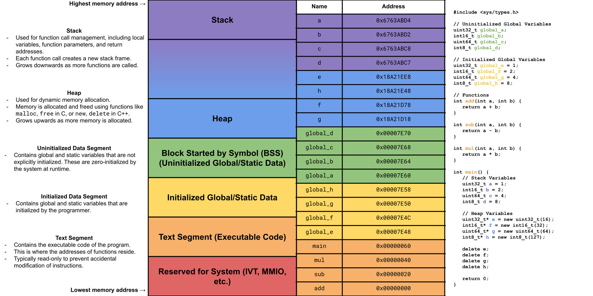
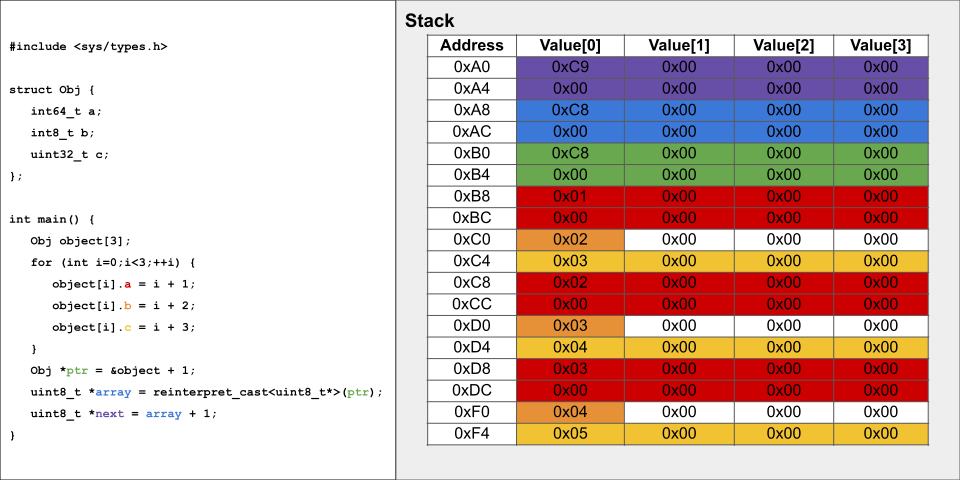
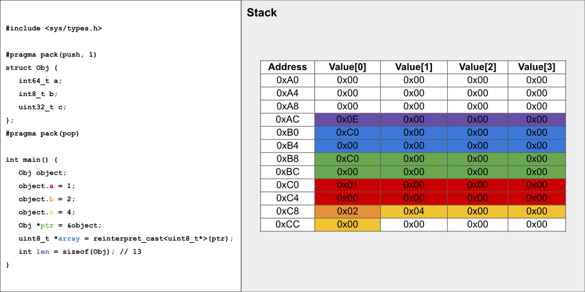
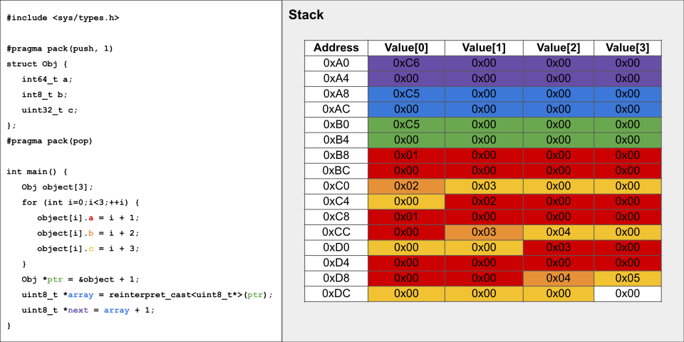
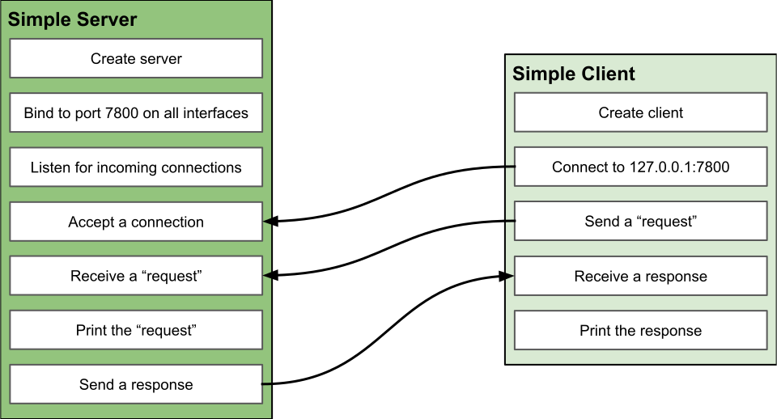
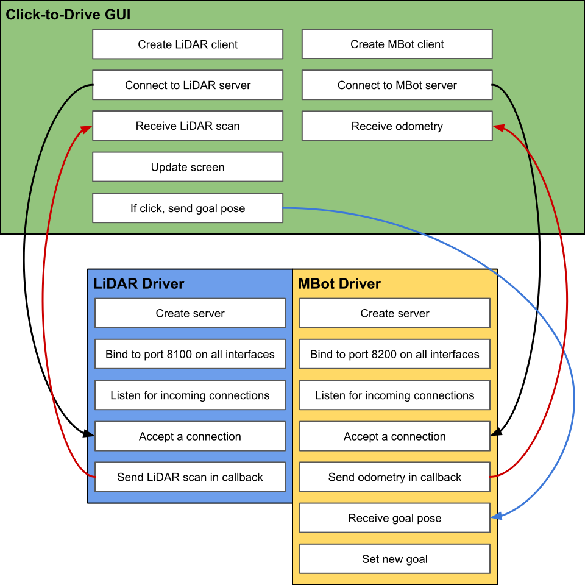

# Project 2: Click to Drive
{: .no_toc }
Due at 10:29 AM on February 3
{: .fs-6 .fw-300 }

## Getting the Starter Code
Navigate to the directory where you would like to store the code for this project. Run the following commands to install the project starter code or download it manually [here](https://www.dropbox.com/scl/fi/r62jlzckjp6sfl7rrub9w/Project2.tar.gz?rlkey=9lnn7jr07az9tu4ob6vtnkxou&st=owdjyn7d&dl=0).
```bash
wget "https://www.dropbox.com/scl/fi/r62jlzckjp6sfl7rrub9w/Project2.tar.gz?rlkey=9lnn7jr07az9tu4ob6vtnkxou&st=owdjyn7d&dl=0" -O p2.tar.gz
tar -xf p2.tar.gz
rm p2.tar.gz
```

It is *strongly* recommended to use GitHub to track the changes made to your project. First, create a new **private** repository in GitHub. Then, navigate to the project directory and run the following commands.
```bash
git init
git commit -m "first commit"
git branch -M main
git remote add origin [LINK TO REPO]
git push -u origin main
```
This will establish a main branch on the remote repository and add the starter code as the first commit.

## Learning Objectives
1. Implement TCP server and client socket interfaces.
2. Implement message serialization and deserialization functions.
3. Use RPLIDAR A1 and MBot drivers.
4. Understand how to design robust server and client applications.

## Overview
This project covers server/client applications, the TCP protocol, message serialization, and device drivers. Simple concurrency and multithreaded programming are also briefly convered. There are 4 components to Project 2: **TCP Server and Client Interfaces**, **Simple TCP Server and Client**, **LiDAR Driver**, and **MBot Driver**. The following instructions provide a high-level overview of the project. More detailed instructions are in the TODOs in the starter code.

## A Note on Process Memory
In C and C++, memory management is largely manual, and it's critical for programmers to understand the underlying memory model to write efficient code.

### Process Memory Structure in C and C++

A process's memory in C and C++ is typically divided into several segments. The diagram below describes these segments and gives an example program on the right, which shows the addresses in memory where the process stores its data.



The important takeaway from this diagram for this project is that **functions have accessible locations in memory like variables**, meaning we can have **pointers to functions** (i.e. function pointers). This is key to the `lidar_driver` and `mbot_driver` programs that you will implement in [2.3](./p2.html#24-lidar-driver) and [2.4](./p2.html#24-mbot-driver), which require you to set callback functions (function pointers) that will be executed in a separate thread.

### Structs in C and C++
Structs:

A struct in C and C++ is a composite data type that groups together variables under one name. These variables, known as members or fields, can be of different types. When a struct is declared, the memory layout for the data members is set up in a contiguous block.

Under normal circumstances, all atomic data types need to be placed in memory at an addresses divisible by a their size. This conecpt is called *alignment*. For example, an `int32_t` must start at an address that is a multiple of 4. Below is a table that contains the size and alignment for all atomic data types in C++.

|                  Name                  | Size (Bytes) | Alignment (Bytes) |
|----------------------------------------|--------------|-------------------|
| int8_t (char)                          | 1            | 1                 |
| uint8_t (unsigned char)                | 1            | 1                 |
| int16_t (short)                        | 2            | 2                 |
| uint16_t (unsigned short)              | 2            | 2                 |
| int32_t (int, long)                    | 4            | 4                 |
| uint32_t (unsigned int, unsigned long) | 4            | 4                 |
| int64_t  (long long)                   | 8            | 8                 |
| uint64_t (unsigned long long)          | 8            | 8                 |
| float                                  | 4            | 4                 |
| double                                 | 8            | 8                 |
| pointer (64-bit system)                | 8            | 8                 |
| pointer (32-bit system)                | 4            | 4                 |


For memory efficiency, it is important that structs maintain this alignment among their fields. To ensure alignment for a struct, the compiler will add unused bytes (*padding*) between the members of a struct. This is shown in the following figure.


Notice how there are 3 unused bytes between `Object::b` and `Object::c`. This happens because a `uint32_t` must be aligned with an address divisble by 4. Here is an example of padding within an array of structs.



There are compiler directives that we can toggle to disable padding. A programmer may want to do this if they are under severe memory constraints (often at the embedded system level). Here are the same examples as above, but with the `Object` struct packed.






### Memory Representation in High-Level Languages
- **Python**
  - Python manages memory through a more abstracted, automated system using a technique called garbage collection.
  - Instead of memory being contiguous like in C/C++, Python objects are often scattered throughout memory and accessed via references.
  - Python’s data structures (e.g., lists, dictionaries) are dynamic and can grow and shrink as needed, unlike the fixed memory layout in C/C++ structs.
  
- **JavaScript**
  - JavaScript similarly uses a garbage-collected memory model, abstracting memory management details away from the programmer.
  - Objects in JavaScript are dynamic and flexible, akin to Python’s, with properties that can be added or removed at runtime.

### Data Serialization and Marshalling
You may be asking yourself: "*Why is any of this important for a project about TCP sockets?*"

As you begin to venture into the world of interprocess communication, you will begin to encounter the difficult task of ensuring that programs written in different languages, running on different operating systems on different hardware are able to communicate effectively. Here lies the key takeaway from the discussion of C structs: **serialization**.

To pass messages from one program to another successfully, we need to ensure that the raw bytes are able to be reconstructed into a useful object at the receiving side. In ROB 320, all of our message types (such as `Pose2D` or `LidarScan` that you will encounter shortly), are C structs. This means that they are contiguous and statically allocated (have fixed size at compile time). To marshal these messages, we transport the bytes contained within the struct because we know the *address* and *size* of our struct.

This greatly simplifies our serialization protocol for C and C++ programs. On the sender side (encoding the data), we cast our struct pointer to a byte pointer (`uint8_t*`)--this effectively creates a byte array that we know the length of (because our struct has a fixed length). On the receiver side, as long as we know the type of message to expect, we can store the received bytes in an actual byte array, and then cast the pointer to the start of that array into the struct (decoding the data).

**However**, as discussed above, high-level languages like Python and JavaScript have no support for C structs natively, which makes this serialization protocol difficult (but not impossible) to implement for programs in those languages. You do not need to worry about this now. The Python GUI for click-to-drive is written for you. **However**, as a future engineer, it is important that you understand the implications that these decisions can have at a systems level.

The compiler directives `#pragma pack(push, 1)` and `#pragma pack(pop)` are used before and after our message definitions to tell our compiler to pack our structs (set their alignment to 1). This is a necessary aspect of the serialization protocol because the MBot Firmware expects the messages to have this format. Aside from this constraint, packing our structs ensures that there is no wasted memory, making the transport layer more efficient, as it does not waste time sending bytes that have no significant value. It also makes it slightly easier to decode the messages in other languages that don't support C struct alignment.

Now, onto the actual project.

## 2.1: TCP Socket Interface (4 points)
### TODO
- **`src/sockets/client.cpp`**
  - Implement `Client` class.
- **`src/sockets/server.cpp`**
  - Implement `Server` class.
  - Implement `Connection` class.

Implement the TCP Server, Client, and Connection classes. The header files contain the class definitions with all necessary member functions and variables defined for you. Implement the member functions in the source files listed above.

## 2.2 Simple Server and Client (2 points)
### 2.2.1: Simple TCP Server
### TODO
- **`src/simple_server.cpp`**
  - Implement `main` function.

Project 2 component 2 is meant to simulate the request-response model. There are two programs that you must implement.

The first program, `simple_server`, should run until a `SIGINT` or `SIGTERM` signal is received. `simple_server` should accept a connection from a client, receive a message from the client, print the message, and send a response message.

### 2.2.2: Simple TCP Client
### TODO
- **`src/simple_client.cpp`**
  - Implement `main` function.

The second program, `simple_client`, should connect to the server, send a message, receive a message, and print the message it received.

The process flow for these programs are pictured below.



## 2.3 Serialization (1 point) 
### TODO
- **`include/robot/msgs/LidarScan.hpp`**
  - Implement `LidarScan::encode` function.
  - Implement `LidarScan::decode` function.
- **`include/robot/msgs/Timestamp.hpp`**
  - Implement `Timestamp::encode` function.
  - Implement `Timestamp::decode` function.
- **`include/robot/msgs/Twist2D.hpp`**
  - Implement `Twist2D::encode` function.
  - Implement `Twist2D::decode` function.
- **`include/robot/msgs/Pose2D.hpp`**
  - Implement `Pose2D::encode` function.
  - Implement `Pose2D::decode` function.

Implement the `encode` and `decode` functions for the `LidarScan`, `Timestamp`, `Twist2D` and `Pose2D` message types. The encode function should transform the data objects into an array of bytes, and the decode functino should transform an array of bytes into a data object.

## 2.4: Device Drivers (3 points)
### 2.4.1: LiDAR Driver
### TODO
- **`src/lidar_driver.cpp`**
  - Implement `on_scan` function.
  - Implement `signal_handler` function.
  - Implement `main` function.

The LiDAR Driver is a program that hosts a server that will stream LiDAR scans to a client that makes a connection. The `Lidar` class has been implemented for you (`include/robot/lidar.hpp` and `src/robot/lidar.cpp`). It provides a member function called `set_on_scan`, where you can set the function that will be called after each scan has been read over the USB. In this callback function, you should serialize the `LidarScan` object and send it to the TCP client that has been connected.

### 2.4.2: MBot Driver
### TODO
- **`src/mbot_driver.cpp`**
  - Implement `on_pose` function.
  - Implement `signal_handler` function.
  - Implement `main` function.

The MBot Driver is a program that hosts a server that will stream odometry data to a client that makes a connection. Unlike the LiDAR Driver, the MBot Driver receives goal poses from its client and uses a motion controller to drive to the set points.

The `MBot` class has been implemented for you (`include/robot/mbot.hpp` and `src/robot/mbot.cpp`). It provides a member function called `set_on_pose`, where you can set the function that will be called after an odometry message has been read over the USB. In this callback function, you should serialize the `Pose2D` object and send it to the TCP client that has been connected.

The click-to-drive GUI will send goal poses to the server's connection when the user clicks on unoccupied space. Once you receive a goal pose, decode it, and use the `MBot::drive_to` function to set the goal.

## Building
To compile the entire project, run the following commands. The `build` directory will not exist by default, you must create it first.
```bash
cd build
cmake ..
make
```

If you would like to build separate parts of the project individually, add the executable name after `make`. For example:
```bash
cd build
cmake ..
make [simple_server | simple_client | lidar_driver | mbot_driver]
```
This is especially useful if you have not implemented other parts of the project and want to test what you have implemented.

## The Click-to-Drive GUI
In order for the GUI to run properly, it must be able to establish connections to both the LiDAR Driver and the MBot Driver. It must also receive messages from both of these processes. The display will not update if there is an error. The Python GUI has debugging output for you to use to diagnose bugs within your drivers.

Here is a diagram visualizing how the LiDAR Driver, MBot Driver, and Click-to-Drive GUI interface with each other.



To use the click-to-drive GUI, both servers must be running first. To start the servers run the following commands on your MBot after successfully building the project.

Terminal 1
```bash
cd build
./mbot_driver
```

Terminal 2
```bash
cd build
./lidar_driver
```

The GUI is not intended to run on the MBot. Clone your project repository onto your laptop and start the GUI by entering the following commands:
```bash
cd python
python3 -m venv venv
source venv/bin/activate
pip install -r requirements.txt
python3 click_to_drive.py [IP ADDRESS OF MBOT]
```

This will run the program in a Python virtual environment, once you are done using the GUI, you can stop the virtual environment with
```bash
deactivate
```

To run the GUI after installing the dependencies, you only need to run the following.
```bash
cd python
source venv/bin/activate
python3 click_to_drive.py [IP ADDRESS OF MBOT]
```

## Grading and Submission
Below is the grading outline for Project 2.

| Feature                  | Points |
|--------------------------|--------|
| TCP Socket Interface     | 4      |
| Simple Server and Client | 2      |
| Serialization            | 1      |
| Device Drivers           | 4      |

Submit the necessary files to the [ROB 320 Autograder](http://autograder.io).