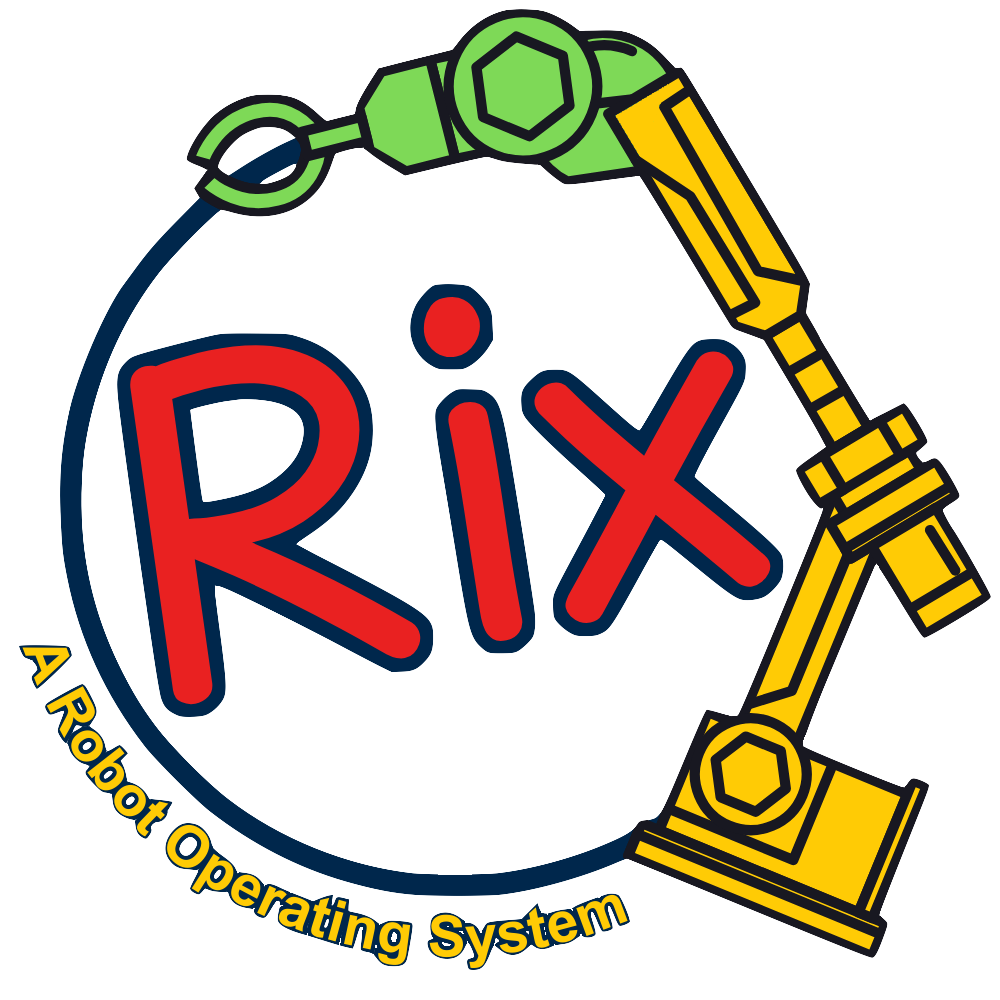
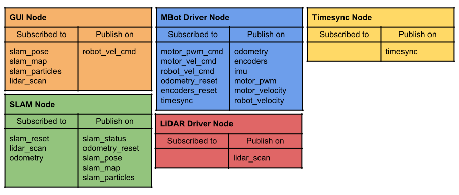
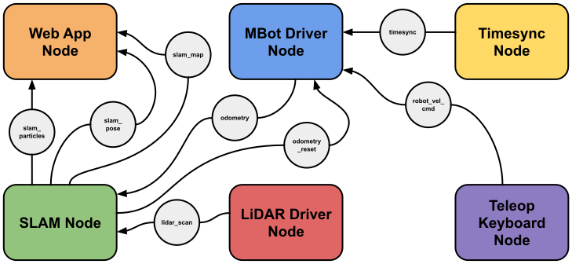

# Project 3: RIX
{: .no_toc }
Due at 11:59 PM on February 28
{: .fs-6 .fw-300 }



## Getting the Starter Code
Navigate to the directory where you would like to store the code for this project. Run the following commands to install the project starter code or download it manually [here](https://www.dropbox.com/scl/fi/61dk1iz8qajxrwyemgjxc/Project3.tar.gz?rlkey=6g3gn7foqfyudomyy0tq2xdhj&st=xawdezi2&dl=0).
```bash
wget "https://www.dropbox.com/scl/fi/61dk1iz8qajxrwyemgjxc/Project3.tar.gz?rlkey=6g3gn7foqfyudomyy0tq2xdhj&st=xawdezi2&dl=0" -O p3.tar.gz
tar -xf p3.tar.gz
rm p3.tar.gz
```

It is *strongly* recommended to use GitHub to track the changes made to your project. First, create a new **private** repository in GitHub. Then, navigate to the project directory and run the following commands.
```bash
git init
git commit -m "first commit"
git branch -M main
git remote add origin [LINK TO REPO]
git push -u origin main
```
This will establish a main branch on the remote repository and add the starter code as the first commit.

## Learning Objectives
1. Implement a centralized, topic-based, loosely-coupled, publish-subscribe system using TCP sockets
2. Understand the architecture of robot programs as a graph of nodes connected by topics
3. Understand how a robot operating system is a layer of abstraction above a regular operating system

## Overview
### Robot Operating System Semantics
The following was adapted from the [official ROS documentation](http://wiki.ros.org).

A node is a process that performs computation. Nodes are combined together into a graph and communicate with one another using topics. Topics are named buses over which nodes exchange messages. Topics have anonymous publish/subscribe semantics, meaning nodes can operate independently, without direct dependencies on each other. In general, nodes are not aware of who they are communicating with. Instead, nodes that are interested in data subscribe to the relevant topic; nodes that generate data publish to the relevant topic. There can be multiple publishers and subscribers to a topic. You can think of Nodes as vertices and topics as edges in a graph.

Nodes are meant to operate at a fine-grained scale; a robotic system will usually comprise many nodes. Below is a graph for the system that you will implement in this project.





The use of nodes provides several benefits to the overall system. There is fault tolerance as crashes are isolated to individual nodes, code complexity is reduced in comparison to monolithic systems, implementation details are well hidden as the nodes expose a minimal API to the rest of the graph, and alternate implementations, even in other programming languages, can easily be substituted.

In a loosely-coupled system, a node needs the ability to discover other nodes that are publishing on or subscribed to its relevent topics. You will implement a centralized system to handle node discovery. In ROS, this is called the Master ([see why this naming convention is outdated](https://www.nytimes.com/2021/04/13/technology/racist-computer-engineering-terms-ietf.html)). This central process provides naming and registration services to the rest of the nodes in the system, maintaining a ledger mapping publishers and subscribers to topics. It enables individual nodes to locate one another. Once these nodes have located each other they communicate with each other peer-to-peer. In Lab 2, you implemented a chat and log program that commuicated with a discovery server. This was a simplified version of the publish-subscribe system that you will implement in this project.

### RIX Libraries
This project depends on four libraries: `rix-util`, `rix-ipc`, `rix-msg`, and `mbot-msgs`. These precompiled libraries are in the starter code with their associated headers. The implementations of these libraries are hidden from you because they contain solution code to the previous projects you have worked on so far. The associated headers are available in the `include/` directory of the project. All of the header files in this directory are well documented. An overview of their purpose is below, but more in depth information can be found in the starter code.

1. **`rix/util`**
  - Signal handling
  - Command line argument parsing
  - Timing libraries to control loop frequency
  - Thread-safe data logging library
2. **`rix/ipc`**
  - TCP socket interfaces (from Project 2)
3. **`rix/msg`**
  - Message struct definitions and serialization functions

The precompiled binary files for these libraries are located in the `lib` directory. There are two version of these binaries: CAEN and MBot. Unforunately, we cannot target everybody's operating system individually, so this project (more so than the projects prior) will require you to develop on CAEN or the MBot. In order to compile your project, it must link against the libraries in `lib/caen` or `lib/mbot`.

## 3.1.1 Node Implementation (1 Point)
### TODO
- **`rix/include/rix/core/node.hpp`**
  - Implement `Node::advertise<TMsg, TImpl>()` and `Node::subscribe<TMsg, TImpl>()` functions.
- **`rix/src/core/node.cpp`**
  - Implement the `Node` class.

## 3.1.2 Publisher Implementation (1.5 Points)
### TODO
- **`rix/include/rix/core/publisher/`**
  - **`publisher.hpp`**
    - Implement `Publisher::publish<TMsg>()` function.
- **`rix/src/rix/core/publisher/`**
  - **`publisher.cpp`**
    - Implement `Publisher` class.
  - **`pub_impl_base.cpp`**
    - Implement `PubImplBase` class.
  - **`pub_impl_tcp.cpp`**
    - Implement `PubImplTCP` class.

## 3.1.3 Subscriber Implementation (1.5 Points)
### TODO
- **`rix/include/rix/core/subscriber/`**
  - **`subscriber_callback.hpp`**
    - Implement `SubscriberCallback<TMsg>::call()` function.
- **`rix/src/rix/core/subscriber/`**
  - **`subscriber.cpp`**
    - Implement the `Subscriber` class.
  - **`sub_impl_base.cpp`**
    - Implement `SubImplBase` class.
  - **`sub_impl_tcp.cpp`**
    - Implement `SubImplTCP` class.

Feature 1 requires you to implement the node, publisher, and susbcriber systems as described in the overview. Both the subscriber and publisher use encapsulation and inheritance to abstract implementation details away from the user. This organizes these classes into layers described below.

1. User Interface Layer: `rix::core::Publisher` and `rix::core::Subscriber`
  - Highest level of abstraction. These classes provide functions that programmers will use directly when writing RIX nodes. The `rix::core::Node` class also interfaces with publishers and susbcribers at this level. 
  - Hides implementation details. The RIX source version offers a variety of transport protocols, including TCP, UDP multicast, WebSockets, and shared memory. You will only implement RIX using TCP. This layer ensures all implementations have the same interface (i.e. `advertise`, `subscribe`, `publish`, and `spin` are the same to the user regardless of the transport protocol).
  - Contains pointers to the base implementation objects. This layer uses encapsulation to interface with the implementation layer.
  
2. Component Interface Layer: `rix::core::PubImplBase` and `rix::core::SubImplBase`
  - Middle level of abstraction. These classes provide the `rix::core::Publisher` and `rix::core::Subscriber` classes an interface that enables connections to be establish and serialized messages to be past from publisher to subscriber. 
  - These classes are abstract base classes. They provide virtual methods that outline how an implementation of a RIX publisher or subscriber ought to behave. 
  - Implementations will derive from this base class and implement its virtual methods with functions that will use a transport protocol to establish connections and marshal messages.

3. Transport Layer: `rix::core::PubImplTCP` and `rix::core::SubImplTCP`
  - Lowest layer of abstraction. These claseses derive from the base implementation classes, implementing the virtual methods with a specific transport protocol.

Each publisher and subscriber contains a `ComponentInfo` struct that you will need to fill with the necessary information in the `rix::core::Publisher` and `rix::core::Subscriber` constructors.. The `rix::msg::component::ComponentInfo` and `rix::msg::component::MessageInfo` structs are shown below.

```cpp
struct ComponentInfo {
    component::MessageInfo message_info[3];
    uint64_t node_id;
    uint64_t component_id;
    uint64_t machine_id;
    uint8_t protocol;
    char topic[32];
}
```

- The `message_info` field is an array of `MessageInfo` structs. These structs provide information about the type of messages that the publisher or subscriber expect to use.
- The `node_id` field is a 'unique' ID for each node.
- The `component_id` field is a 'unique' ID for each publisher and susbcriber.
- The `machine_id` field is a 'unique' ID for every machine that installs RIX.
- The `protocol` field is a byte that describes the implementation being used (in our case it will always be TCP: 0x01).
- The `topic` field is a char array that contains the name of the relevant topic for the publisher or subscriber.

(Note: we say 'unique' because there is no way to ensure true uniqueness among the IDs we will use in this project. There should be a low likelihood that the IDs collide i.e. we can use random numbers)

```cpp
struct MessageInfo {
    uint64_t hash_upper;
    uint64_t hash_lower;
    uint32_t length;
}
```

- The `hash_upper` field is the upper 64 bits of a truly unique message ID.
- The `hash_lower` field is the lower 64 bits of a truly unique message ID.
- The `length` field is the size of the message in bytes.

(Note: these hashes are truly unique because they are calculated using an [MD5 Hash](https://en.wikipedia.org/wiki/MD5) over the message definition file, which produces a 128-bit value from a sequence of characters. Each message has an `info` method that can be used to obtain the `MessageInfo` struct for that message type. These methods can be found in the message header files in `include/rix/msg/`.)

Each publisher and subscriber will also have a contact ID used for discovery. This is important because subscribers need to know the URI of the publisher that they will be connecting to. Additionally, both subscribers and publishers need to order their clients/connections according to some ID so that they know which to modify upon disconnection. The `ID` struct is shown below with the `URI` struct.
```cpp
struct ID {
    uint64_t component_id;
    component::URI uri;
}
```

- The `component_id` field is a 'unique' ID for each publisher and susbcriber (the same as above).
- The `uri` field is the resource identifier that will enable network communication.

```cpp
struct URI {
    uint16_t port;
    char address[16];
}
```

- The `port` field is the port being used by the `Client` or `Server`.
- The `address` field is the IP address of the `Client` or `Server`.

To create `rix::core::Publisher` and `rix::core::Subscriber` objects, the user will call `Node::advertise` and `Node::subscribe`. These methods will create a `std::shared_ptr` to the publisher or subscriber and will store them in a map contained by the `Node` class. The `std::shared_ptr` is used because the user and node share ownership of the objects, so we do not want one to deallocate the memroy on the heap while the other is still using the object. 

In `Node::advertise` and `Node::subscribe`, the components must be registered with the mediator so that others can discover and connect to them. There are helper functions provided that you must implement and call to do this. When a component shuts down (via the `shutdown` method of the component or when a node's destructor is invoked), it must also be deregistered with the mediator so that future components will not attempt to connect to an unavailable resource. This should be handled in `Node::spin` and in `Node::shutdown`.

All messages to and from the mediator are `rix::msg::component::Info` messages, which contain a `ComponentInfo` and an `ID` message along with some metadata including an `error` and `opcode` field.
```cpp
struct standard::Info {
    standard::ComponentInfo component_info;
    standard::ID contact_id;
    uint8_t opcode;
    uint8_t error;
}
```

If the message is sent by the mediator:
- The `component_info` field contains information about the relevant publisher or subscriber contained by the node receiving the message.
- The `contact_id` field contains information about which publisher or subscriber is attempting to connect/disconnect

If the message is sent by a node:
- The `component_info` field contains information about the publisher or subscriber that is registering/deregistering with the mediator.
- The `contact_id` field contains the information necessary for a separate publisher or subscriber to connect to the relevent publisher or subscriber.

- The `opcode` field determines that type of operation that will occur based on this message. These opcodes are contained by the enum `OPCODE` in `include/rix/core/common.hpp`. A subset of these opcodes are shown below (these are the only ones necessary for this project):
```cpp
enum OPCODE {
    SUB_REGISTER = 80,
    PUB_REGISTER,
    SUB_NOTIFY = 90,
    PUB_NOTIFY,
    SUB_DEREGISTER = 100,
    PUB_DEREGISTER,
    SUB_DISCONNECT = 110,
    PUB_DISCONNECT,
    MED_TERMINATE = 160
};
```
- The `error` field is a byte that represents whether or not an error has occurred. For the purposes of this project, assume that if the `error` field is nonzero, then an error has occured. The value of this error does not matter.

## 3.2 Mediator Implementation (3 Points)
### TODO
- **`rixhub/src/mediator.cpp`**
  - Implement the `Mediator` class.
- **`rixhub/src/ledger.cpp`**
  - Implement the `Ledger` class.
- **`rixhub/src/rixhub.cpp`**
  - Implement the main executable for `rixhub`.

Feature 2 requires you to implement the central process responsible for node discovery. You will implement the `Mediator` class, which will handle register and deregister messages from nodes. The `Mediator` class uses the `Ledger` class to track the topics, publishers, and subscribers relevent to each `Node`. The main program that you will implement is `rixhub.cpp`. 

When a subscriber registers, the mediator is responsible for sending that subscriber the contact ID and component info for every publisher on the same topic using the same protocol. Similarly, when a publisher registers, the mediator must send the contact ID and component info for every subscriber on the same topic using the same protocol.

When a subscriber deregisters, the mediator must send a disconnect message to all publishers on that topic using the same protocol so they know which susbcriber to remove from their containers. When a publisher deregisters, the mediator must send a disconnect message to all subscribers on that topic using the same protocol so they know which publisher to remove from their containers.

## 3.3.1 Talker Node (0.5 Point)
### TODO
- **`src/talker.hpp`**
  - Implement the `talker` executable.

## 3.3.2 Listener Node (0.5 Point)
### TODO
- **`src/listener.hpp`**
  - Implement the `listener` executable.

Feature 3 requires you to implement a simple listener/talker example. This is modeled after the ROS tutorial [Writing a Simple Publisher and Subscriber (C++)](http://wiki.ros.org/ROS/Tutorials/WritingPublisherSubscriber%28c%2B%2B%29). Take a look at the tutorial before implementing the programs to see the similarities/differences between the ROS and RIX APIs. The ROS tutorial will use the `std_msgs::String` message type. We require you to use the RIX `rix::msg::standard::Header` message type found in `include/rix/msg/standard/Header.hpp`. More detailed instructions can be found in the project starter code.

## 3.4 Lidar Driver Node (1 Point)
### TODO
- **`lidar_driver/src/main.cpp`**
  - Implement the `LidarDriver` class.
  - Implement the `main` function.

Feature 4 requires you to implement a node that publishes `rix::msg::mbot::LidarScan` messages on the topic `lidar_scan`. You will use the `Lidar` class provided to you, which is very similar to the `Lidar` class from Project 2. Developing this feature does **not** require the use of an MBot. If you compile without the `MBOT` flag set, the `Lidar` class will generate random scans without needing to read from `/dev/rplidar`.

## 3.5 MBot Driver Node (1 Point)
### TODO
- **`mbot_driver/src/main.cpp`**
  - Implement the `MBotDriver` class.
  - Implement the `main` function.

Feature 5 requires you to implement the MBot driver node, which will communicate on several topics. They are shown in the tables below.

**Subscribers**

| Topic | Message Type |
|-------|--------------|
| motor_pwm_cmd  | `rix::mbot::MotorPWM`      |
| motor_vel_cmd  | `rix::mbot::MotorVelocity` |
| robot_vel_cmd  | `rix::mbot::Twist2D`       |
| odometry_reset | `rix::mbot::Pose2D`        |
| encoders_reset | `rix::mbot::Encoders`      |
| timesync       | `rix::mbot::Timestamp`     |

**Publishers**

| Topic | Message Type |
|-------|--------------|
| odometry_reset | `rix::mbot::Pose2D`        |
| encoders_reset | `rix::mbot::Encoders`      |
| imu            | `rix::mbot::IMU`           |
| motor_pwm      | `rix::mbot::MotorPWM`      |
| motor_velocity | `rix::mbot::MotorVelocity` |
| robot_velocity | `rix::mbot::Twist2D`       |

In the MBot Driver, you are responsible for wrapping the `MBot` class as a node, using `MBot::set_callback` to publish information on the relevant topic and `MBot::send_message` within the subscriber callbacks to send the relevant message over USB to the MBot. Developing this feature does **not** require the use of an MBot. If you compile without the `MBOT` flag set, the `MBot` class will generate random data for the various message types without needing to read from `/dev/mbot_lcm`. Additionally, in this mode, when a message is received by a subscriber, a message with the `topic_id` and `msg_len` of the message will be logged.

## Building
The `build` directory will not exist by default, you must create it first. For this project, there are flags that you must pass to the compiler depending on the system you are building on. For building on CAEN, you must first load a more recent version of gcc so that we can compile modern C++.
```bash
module load gcc/11
export CC=/usr/um/gcc-11.3.0/bin/gcc
export CXX=/usr/um/gcc-11.3.0/bin/g++
```

Then, you can build the project.
```bash
mkdir build
cd build
cmake -DCAEN=ON ..
make
```

For building on the MBot, run the following commands. The default gcc version on the MBot is able to compile modern C++.
```bash
mkdir build
cd build
cmake -DMBOT=ON ..
make
```

If you would like to build separate parts of the project individually, add the executable name after `make`. For example:
```bash
cd build
cmake ..
make [rixhub | lidar_driver | mbot_driver | talker | listener]
```
This is especially useful if you have not implemented other parts of the project and want to test what you have implemented.

We understand that this project is much larger in scope compared to the previous two projects. With that in mind, we have provided some precompiled executables in the `bin` folder of the starter code, including `rixhub`, `slam`, `timesync`, and `teleop_keyboard`. These executables were compiled with the solution code and provided for you to help test and debug your implementation of RIX. We have provided the source code for the `timesync` and `teleop_keyboard` in `src`. There are also implementations for `lidar_listener`, `odometry_listener`, and `slam_pose_listener` nodes to help you debug, however, we have not provided the binaries for these implementations, so your `Node`, `Publisher`, and `Subscriber` classes must be working for them to execute properly. 

You can use the solution binary of rixhub to test your implementations of `Node`, `Publisher`, and `Subscriber`. To run the `rixhub` executable, enter the following command. Use the directory that corresponds to the system you are working on. For the MBot:
```bash
./bin/mbot/rixhub
```
For CAEN:
```bash
./bin/caen/rixhub
```

You can use the other executables to debug your implementations of `lidar_driver`, `mbot_driver`, and `rixhub`. You can add the `-h` flag to toggle to help message to display the command line arguments that the executables need.
```bash
./bin/[mbot | caen]/[slam | timesync | teleop_keyboard] [-h]
```

## RIX SLAM GUI
<!-- Once your Lidar driver and MBot drivers are working, you can use the provided SLAM GUI to visualize the mapping and localization happening in the `slam` executable. This GUI is similar to Project 2 Click-to-Drive. Ensure that you are using Python 3.9 or later!
```bash
cd rixslam-gui
python3 -m venv venv
source venv/bin/activate
pip install -r requirements.txt
pip install ./rixcore
pip install ./rixmsg
python3 slam_gui.py -i [IP ADDRESS OF MBOT]
``` -->
Coming soon ...

## Grading and Submission
Below is the grading outline for Project 2.

| Feature                          | Points |
|----------------------------------|--------|
| Node Implementation              | 1      |
| Publisher Implementation	       | 1.5    |
| Subscriber Implementation	       | 1.5    |
| Mediator Implementation          | 3      |
| Talker Node                      | 0.5    |
| Listener Node                    | 0.5    |
| Lidar Driver Node                | 1      |
| MBot Driver Node                 | 1      |

Submit the files below to the [ROB 320 Autograder](http://autograder.io).

```plaintext
publisher.hpp
subscriber_callback.hpp
node.hpp
pub_impl_base.cpp
pub_impl_tcp.cpp
publisher.cpp
sub_impl_base.cpp
sub_impl_tcp.cpp
subscriber.cpp
node.cpp
ledger.cpp
rixhub.cpp
lidar_driver.cpp
mbot_driver.cpp
```

Included in the starter code is a shell script that takes a text file as input. It will search for files in your project directory that match the names of the files in the input text file. It will copy these files into a `submit` directory so that it is easier for you to find your files when submitting to the autograder. This was a helpful script written by Amy Lee that we chose to include in this project. To run the script. enter the following:

```bash
sh collect_files.sh ag_files.txt
```