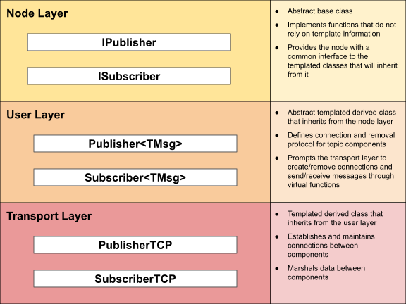
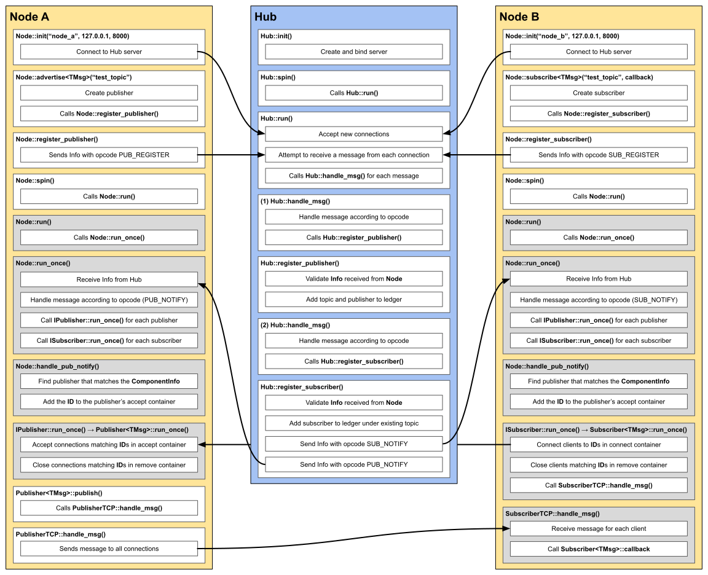

# Project 3: RIX
{: .no_toc }
Due at 11:59 PM on TBD
{: .fs-6 .fw-300 }


## Getting the Starter Code
Navigate to the directory where you would like to store the code for this project. Run the following commands to install the project starter code.
```bash
wget https://robotoperatingsystemscourse.github.io/assets/projects/roscourse-p3-stencil.tar.gz
tar -xf roscourse-p3-stencil.tar.gz
rm roscourse-p3-stencil.tar.gz
```
It is *strongly* recommended to use GitHub to track the changes made to your project. First, create a new **private** repository in GitHub. Then, navigate to the project directory and run the following commands.
```bash
git init
git commit -m "first commit"
git branch -M main
git remote add origin [LINK TO REPO]
git push -u origin main
```
This will establish a main branch on the remote repository and add the starter code as the first commit.

## Learning Objectives
1. Implement a centralized, topic-based, loosely-coupled, publish-subscribe system using TCP sockets
2. Understand the architecture of robot programs as a graph of nodes connected by topics
3. Understand how a robot operating system is a layer of abstraction above a regular operating system

## Overview
### ROS Semantics
The following was adapted from the [official ROS documentation](http://wiki.ros.org).

A node is a process that performs computation. Nodes are combined together into a graph and communicate with one another using topics. Topics are named buses over which nodes exchange messages. Topics have anonymous publish/subscribe semantics, meaning nodes can operate independently, without direct dependencies on each other. In general, nodes are not aware of who they are communicating with. Instead, nodes that are interested in data subscribe to the relevant topic; nodes that generate data publish to the relevant topic. There can be multiple publishers and subscribers to a topic.

Nodes are meant to operate at a fine-grained scale; a robotic system will usually comprise many nodes. Below is a graph for the system that you will implement in this project.


The use of nodes provides several benefits to the overall system. There is fault tolerance as crashes are isolated to individual nodes, code complexity is reduced in comparison to monolithic systems, implementation details are well hidden as the nodes expose a minimal API to the rest of the graph, and alternate implementations, even in other programming languages, can easily be substituted.

In a loosely-coupled system, a node needs the ability to discover other nodes that are publishing on or subscribed to its relevent topics. You will implement a centralized system to handle node discovery. In ROS, this is called the Master ([see why this naming convention is outdated](https://www.nytimes.com/2021/04/13/technology/racist-computer-engineering-terms-ietf.html)). This central process provides naming and registration services to the rest of the nodes in the system, maintaining a ledger mapping publishers and subscribers to topics. It enables individual nodes to locate one another. Once these nodes have located each other they communicate with each other peer-to-peer.

### RIX Libraries
This project depends on four libraries: `rix-util`, `rix-ipc`, `rix-msg`, and `mbot-msgs`. These precompiled libraries are in the starter code with their associated headers. 

1. **`rix-util`**
  - Signal handling
  - Command line argument parsing
  - Timing libraries to control loop frequency
  - Logging library to organize command line output
2. **`rix-ipc`**
  - Anonymous and named pipe interfaces
  - TCP, UDP, and Web socket interfaces
  - Shared memory reader and writer interfaces
3. **`rix-msg`**
  - Message struct definitions and serialization functions
  - Contains the `rixmsg` executable for displaying and creating message definitions
4. **`mbot-msgs`**
  - Message definitions compatible withe MBot

## 1.1: RIX Implementation
### TODO
- **`rix/include/rix/core/node.hpp`**
  - Implement `advertise` and `subscribe` functions in `Node` class.
- **`rix/include/rix/core/publisher.hpp`**
  - Implement `Publisher` template.
  - Implement `PublisherTCP` class.
- **`rix/include/rix/core/subscriber.hpp`**
  - Implement `Subscriber` template.
  - Implement `SubscriberTCP` class.
- **`rix/src/core/node.cpp`**
  - Implement the rest of the `Node` member functions (some are done for you).
- **`rix/src/core/publisher.cpp`**
  - Implement the `IPublisher` member functions.
- **`rix/src/core/subscriber.cpp`**
  - Implement the `IPublisher` member functions.

The first component of project 3 requires you to implement the publish-subscribe system. Publishers and subscribers are referred to as components of a node. Each publisher and subscriber will have their own `ComponentInfo` struct that you will need to fill with the necessary information. The `ComponentInfo` struct is shown below. `ComponentInfo` belongs to the namespace `rix::msg::standard`, as you will see when you look into the `rix-msg` header files.

```cpp
struct standard::ComponentInfo {
    uint64_t msg_hash_a[2];
    uint64_t msg_hash_b[2];
    uint64_t msg_hash_c[2];
    uint64_t node_id;
    uint64_t component_id;
    uint64_t machine_id;
    uint8_t protocol;
    char topic[16];
}
```
Your implementation will only need to assign value to the `msg_hash_a`, `node_id`, `component_id`, `protocol`, and `topic` fields for each publisher and subscriber. The other fields will be unused by your implementation, however, in order to be compatible with the RIX source implementation, these fields still need to be included in the structure.

Each component will also have a contact ID. This is important because subscribers need to know the URI of the publisher that they will be connecting to. Additionally, both subscribers and publishers need to order their connections according to some ID so that they know which publisher to modify upon disconnection. The ID struct is shown below with the URI struct.
```cpp
struct standard::ID {
    uint64_t component_id;
    standard::URI uri;
}

struct standard::URI {
    uint16_t port;
    char address[16];
}
```

All messages to and from the Hub are `Info` messages, which contain a `ComponentInfo` and an `ID` message along with some metadata including an `error` and `opcode` field.
```cpp
struct standard::Info {
    standard::ComponentInfo component_info;
    standard::ID contact_id;
    uint8_t opcode;
    uint8_t error;
}
```

There are several layers of abstraction throughout this component of the project. Although it may seem tedious, it provides a useful way of delegating specific tasks to different classes that interoperate with each other. This hierarchy is described below.



Below is a very thorough diagram that shows the process flow of two nodes, one with a publisher and the other with a subscriber, registering with the Hub, connecting to each other directly, and streaming data. This figure will be a very useful reference in your implementation of the publish-subscribe system. **Note**: this diagram does not demonstrate how a node should deregister with the hub and close its connections, nor does it explicitly show how a node should handle multiple subscribers or publishers.



A node will use two threads if `Node::spin` is called with the blocking flag set to `false`. The background thread is responsible for communicating with the Hub and creating, maintaing, and removing connections. For a subscriber, it is also responsible for invoking the callback function set from the `Node::subscribe` call. The foreground thread is the main thread where `Node::spin` was called from. For a publisher, this is where messages are sent from. In the diagram, the background thread is grey and the foreground thread is white.

## 1.2: RIX Hub
### TODO
- **`rix_hub/include/hub.hpp`**
  - Declare containers to store TCP connections and nodes.
- **`rix_hub/include/ledger.hpp`**
  - Declare a container to store information about the registered components.
  - Declare a container to store information about the active topics.
- **`rix_hub/src/hub.cpp`**
  - Implement the `Hub` member functions.
- **`rix_hub/src/ledger.cpp`**
  - Implement the `Ledger` member functions.
- **`rix_hub/src/main.cpp`**
  - Implement the main executable for `rixhub`.

In this component of project 3, you will implement the central process responsible for connecting nodes to each other. You will implement the `Hub` class, which will handle messages from `Node` objects. `Hub` uses the `Ledger` class to track the topics, publishers, and subscribers relevent to each `Node`. The diagram from [1.1](#11-rix-implementation) will also be very useful here, but again, *it does not account for every edge case that you will encounter*. 

## 1.3: LiDAR Driver
### TODO
- **`lidar_driver/src/main.cpp`**
  - Implement the `LidarDriver` class.
  - Implement the `main` function.

Implement a node that publishes `rix::msg::mbot::LidarScan` messages on the topic `lidar_scan`.

## 1.4: MBot Driver
### TODO
- **`mbot_driver/src/main.cpp`**
  - Implement the `MBotDriver` class.
  - Implement the `main` function.

The MBot driver node will communicate on several topics. They are shown in the tables below.

**Subscribers**

| Topic | Message Type |
|-------|--------------|
| motor_pwm_cmd  | `rix::mbot::MotorPWM`      |
| motor_vel_cmd  | `rix::mbot::MotorVelocity` |
| robot_vel_cmd  | `rix::mbot::Twist2D`       |
| odometry_reset | `rix::mbot::Pose2D`        |
| encoders_reset | `rix::mbot::Encoders`      |
| timesync       | `rix::mbot::Timestamp`     |

**Publishers**

| Topic | Message Type |
|-------|--------------|
| odometry_reset | `rix::mbot::Pose2D`        |
| encoders_reset | `rix::mbot::Encoders`      |
| imu            | `rix::mbot::IMU`           |
| motor_pwm      | `rix::mbot::MotorPWM`      |
| motor_velocity | `rix::mbot::MotorVelocity` |
| robot_velocity | `rix::mbot::Twist2D`       |

In the MBot Driver, you are responsible for wrapping the `MBot` class as a node, using `MBot::set_callback` to publish information on the relevant topic and `MBot::send_message` within the subscriber callbacks to send the relevant message over USB to the MBot.

## Building
To compile the entire project, run the following commands.
```bash
cd build
cmake ..
make
```

If you would like to build separate parts of the project individually, add the executable name after `make`. For example:
```bash
cd build
cmake ..
make [rix_hub | lidar_driver | mbot_driver]
```
This is especially useful if you have not implemented other parts of the project and want to test what you have implemented.

We understand that this project is much larger in scope compared to the previous two projects. With that in mind, we have provided some executables in the `bin` folder of the starter code, including `rixhub`, `slam`, `timesync`, and `teleop-keyboard`. These executables were compiled with the solution code and provided for you to help test and debug your implementation of RIX.

You can use the solution binary of rixhub to test your implementations of `Node`, `Publisher`, and `Subscriber`. To run the `rixhub` executable, enter the following command.
```bash
./bin/rixhub
```

You can use the other executables to debug your implementations of `lidar_driver`, `mbot_driver`, and `rixhub`. You can add the `-h` flag to toggle to help message to display the command line arguments that the executables need.
```bash
./bin/[slam | timesync | teleop-keyboard] [-h]
```


##  Testing
There are public unit tests available to you in the `test/` directory of the starter code. To build and run these tests, enter the following commands.
```bash
cd build
cmake ..
make test_public
./test_public
```
The default implementation of the starter code will pass several of these tests. This does not mean that those parts of the starter code are implemented for you or correct. This is just a result of the default return values.

Additionally, these are only the public test cases that we have made available to you. If you are passing all of the public tests, that does **not** mean that your code is free of errors.

## Grading and Submission
This section is coming soon ...